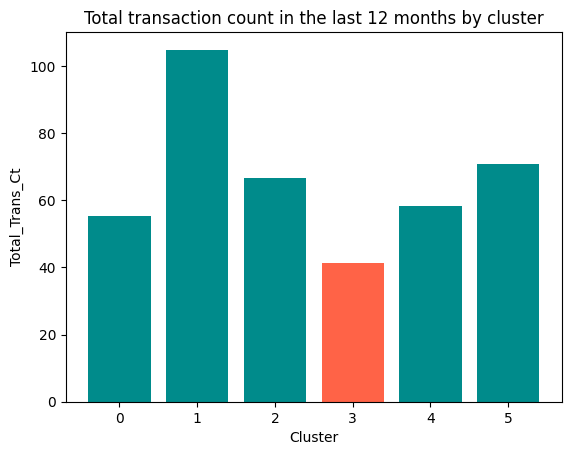

# churn_prediction
## The mission : 

An important financial institution is interested in analyzing its client database to increase the revenue generated from credit cardholders. They are concerned about customers closing their bank accounts after accepting products from other institutions.

The churn rate is above 15% and increasing, the CEO urges the marketing team to start a marketing campaign for client retention.

**What is Churn Rate ?**

*The churn rate, also known as the rate of attrition or customer churn, is the rate at which customers stop doing business with an entity. It is most commonly expressed as the percentage of service subscribers who discontinue their subscriptions within a given time period.*

## **How to ?** 

After the formation of a team with a data engineer, a machine learning engineer, and a data analyst, it is essential to ensure collaboration between the members.

**The data engineers :** 
- Build a database from the customer data.
- Deployment part.

**The ML engineers :**
- Predict those clients with more propensity to close their bank account with the financial institution.
- Build machine learning models for classification and/or clustering.

**The Data analysts :**
- Build a dashboard with data insights and KPIs.
- Create a tableau with tableau public.

## Data Engineer part

### CSV to DB
The first step of the project is to obtain the data from this Kaggle [dataset](https://www.kaggle.com/datasets/sakshigoyal7/credit-card-customers) . The data will then be transformed and loaded into a relational database for further analysis.

Actually Working ! 

## Data Analyst part

Actually Working

## Ml Engineer

To address the business need, we decided to work with two different models, a classification model and a clustering model.\
The classification model selected after testing of several models and parameters fine-tuning is a light GBM model. It is a fast, distributed, high-performance gradient boosting framework supported decision tree algorithm. Following features were used to fit the model: Total_Trans_Amt,Total_Trans_Ct, Total_Ct_Chng_Q4_Q1, Total_Amt_Chng_Q4_Q1, Total_Revolving_Bal, Credit_Limit, Months_on_book, Total_Relationship_Count, Avg_Utilization_Ratio, Contacts_Count_12_mon, Months_Inactive_12_mon and Dependent_count. All these features are bank-related numerical features. The Avg_Open_To_Buy and Customer_Age features where removed due to high correlation with Credit_Limit and Months_on_book.\

\

The fitted model is giving 96% accuracy and 90% recall rate on churning customers which is the most relevant metric in this case. Indeed, we would rather have non churning customers labeled as customers that are likely to churn than missing some customers that are likely to churn by labeling them as non churning customers. The classification model gives a prediction for a specific account. It can be used to check some particularly important accounts or, for example, when a customer gets in touch with the customer service department and they want to check his/her status in order to assess the best way to answer.\

\

However, as the initial request from the business is to support the preparation of a marketing campaign to reduce the churning rate, we developed a clustering model and calculated the churning rate per cluster. This enables the marketing team to target their campaign toward the cluster or several clusters that have the highest churning rates. The best clustering is obtained with the KMeans model. Features were kept consistent with the classification model as the features importance of PCA components was giving very similar features importances to the ones we got in the classification model. \

\

We got the most distinct clusters with 3 clusters. However, we decided to increase this number to 6 as this enables us to separate one cluster from the other that has a very high churning rate.\

\

This gives us a low silhouette score, but high Davies-Bouldin index and Calinski-Harabasz index, suggesting that the clustering algorithm was able to find well-defined clusters in the data, albeit not highly separated ones.\

\

Our suggestion to the marketing team is to target all the members of this cluster as it will bring the highest ROI for the campaign. The cluster represents 15% of the total amount of customers, has a churning rate of 58%. Furthermore, 56% of all churning customers are found in this cluster. We can see that customers in this cluster, without much surprise, have lower transaction count and amount in the last 12 months, lower change in count and transaction amount from Q4 to Q1, higher number of contacts over the last 12 months and more months of inactivity over the last 12 months than any other clusters. In this perspective, we can definitively see some precursor signs which should ring an alarm about the intention of the customers to leave the bank.\

\
\

## **Branch info :**

To be done.

## **Web site visuals and explanation :**

To be done.

## **Contributors :**
- **Data Engineers :** Cyril Verwimp
- **ML Engineers :** Maïté Rolin
- **Data Analysts :** Sacha Jumpertz

## **Timeline :**

To be done.