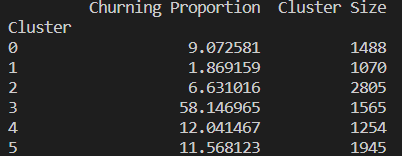

# Churn risk analysis
## **The mission :** 

An important financial institution is interested in analyzing its client database to increase the revenue generated from credit cardholders. They are concerned about customers closing their bank accounts after accepting products from other institutions.

The churn rate is above 15% and increasing, the CEO urges the marketing team to start a marketing campaign for client retention. The marketing department has come to us to help them understand which customers to target.

**What is Churn Rate ?**

*The churn rate, also known as the rate of attrition or customer churn, is the rate at which customers stop doing business with an entity. It is most commonly expressed as the percentage of service subscribers who discontinue their subscriptions within a given time period.*

## **Execution steps** 

1. Build a database from the customer data

2. Build a dashboard with data insights and KPIs

3. Predict clusters of customers with more propensity to churn

4. Analyze cluster characteristics in Tableau

5. Deployment part.

## **1. Database creation by [Cyril Verwimp]**
The first step of the project is to obtain the data from this Kaggle [dataset](https://www.kaggle.com/datasets/sakshigoyal7/credit-card-customers). The data is then transformed and loaded into a relational database for further analysis.

## **2. Data insights by [Jumpertz Sacha]**

The database is used to create dashboards which enables my team to visualize the data and insights of the effect of each variable on the attrition rate of clients. The dashboards can be found here: [exploration Dashboard](https://public.tableau.com/views/churn_prediction_16769651566900/InsightsandKPIsstory?:language=fr-FR&publish=yes&:display_count=n&:origin=viz_share_link)

## **3. Predictions by [Maïté Rolin]**

To address the business need, we decided to work with two different models, a classification model and a clustering model.\
The classification model selected after testing of several models and parameters fine-tuning is a light GBM model. It is a fast, distributed, high-performance gradient boosting framework supported decision tree algorithm. Following features were used to fit the model: Total_Trans_Amt,Total_Trans_Ct, Total_Ct_Chng_Q4_Q1, Total_Amt_Chng_Q4_Q1, Total_Revolving_Bal, Credit_Limit, Months_on_book, Total_Relationship_Count, Avg_Utilization_Ratio, Contacts_Count_12_mon, Months_Inactive_12_mon and Dependent_count. All these features are bank-related numerical features. The Avg_Open_To_Buy and Customer_Age features where removed due to high correlation with Credit_Limit and Months_on_book.

The fitted model is giving 96% accuracy and 90% recall rate on churning customers which is the most relevant metric in this case. Indeed, we would rather have non churning customers labeled as customers that are likely to churn than missing some customers that are likely to churn by labeling them as non churning customers. The classification model gives a prediction for a specific account. It can be used to check some particularly important accounts or, for example, when a customer gets in touch with the customer service department and they want to check his/her status in order to assess the best way to answer.

However, as the initial request from the business is to support the preparation of a marketing campaign to reduce the churning rate, we developed a clustering model and calculated the churning rate per cluster. This enables the marketing team to target their campaign toward the cluster or several clusters that have the highest churning rates. The best clustering is obtained with the KMeans model. Features were kept consistent with the classification model as the features importance of PCA components was giving very similar features importances to the ones we got in the classification model. 

We got the most distinct clusters with 3 clusters. However, we decided to increase this number to 6 as this enables us to separate one cluster from the other that has a very high churning rate.

This gives us a low silhouette score, but high Davies-Bouldin index and Calinski-Harabasz index, suggesting that the clustering algorithm was able to find well-defined clusters in the data, albeit not highly separated ones.

Our suggestion to the marketing team is to target all the members of this cluster as it will bring the highest ROI for the campaign. The cluster represents 15% of the total amount of customers, has a churning rate of 58%. Furthermore, 56% of all churning customers are found in this cluster. We can see that customers in this cluster, without much surprise, have lower transaction count and amount in the last 12 months, lower change in count and transaction amount from Q4 to Q1, higher number of contacts over the last 12 months and more months of inactivity over the last 12 months than any other clusters. In this perspective, we can definitively see some precursor signs which should ring an alarm about the intention of the customers to leave the bank.

## **4. Cluster insights by [Jumpertz Sacha]**

Based on the new database including the labels from the clustering modeling, the analysis of each cluster was done. Results can be found in the following dashboards: [analysis of clusters](https://public.tableau.com/views/Book3-churn_prediction-analyseclusters/Clustersanalysis?:language=fr-FR&publish=yes&:display_count=n&:origin=viz_share_link).

A separate dashboard per cluster was also made to display on the app. These dashboards can be found there: [dashboard for each cluster](https://public.tableau.com/views/Book3-churn_prediction-analyseclusters/all_clusters?:language=fr-FR&publish=yes&:display_count=n&:origin=viz_share_link).

## **5. Deployment by [Cyril Verwimp]** 

Here are the steps that were performed for the deployment :
* Develop a website featuring a form that enables users to make predictions using the model. In addition, allocate space for the dashboard that will be provided by my data analyst.
* Generate a Dockerfile to facilitate the creation of a Docker image for deployment on Render.com. Please note that creating the Docker image is intended for local testing purposes to ensure that the website functions as expected before deployment on Render.com.
* Integrate the functionalities developed by the ML engineer, including the prediction model and the dashboard from the data analyst, into the website.
* Perform thorough testing on the Docker image to ensure that all requirements are met, the prediction model functions correctly, and that the dashboard updates automatically.
* The deployment can be found on Render on following link: https://churn-first-test.onrender.com/ .

## **Branch info :**

### Main branch :
This branch encompasses the code responsible for model creation and training, which has been exclusively developed and executed by our highly skilled ML engineer. All the relevant contributions by the said engineer are readily available on this branch.
### Deployment branch :

This branch is specifically dedicated to the deployment phase of our project, as indicated by its name. Our proficient data engineer has diligently carried out all the necessary tasks related to this phase. Render.com, our chosen hosting service provider, utilizes this branch to execute the rendering process for our website.

## **Link to the [website](https://churn-first-test.onrender.com/) :**

https://churn-first-test.onrender.com/

## **Contributors :**
- **Data Engineer :** [Cyril Verwimp](https://www.linkedin.com/in/cyril-verwimp-8a0457208/)
- **ML Engineer :** [Maïté Rolin](https://www.linkedin.com/in/ma%C3%AFt%C3%A9-r-71290613/)
- **Data Analyst :** [Sacha Jumpertz](https://www.linkedin.com/in/sacha-jumpertz-33ba3623b/)

## **Timeline :**

The project was carried out during the two last weeks of March 2023.